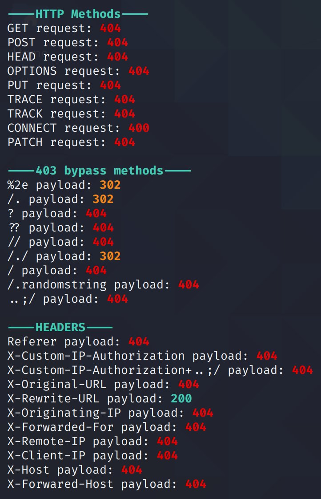

# byp4xx.sh
Simple bash script to bypass "403 Forbidden" messages with well-known methods discussed in #bugbountytips

**Installation:**
```
git clone https://github.com/lobuhi/byp4xx.git

cd byp4xx

chmod u+x byp4xx.sh
```

**Usage:** Start URL with http or https.
```
./byp4xx.sh http(s)://url/path [OPTIONS]

OPTIONS:
-c Return the entire curl command if response is 200
```
**Example:**
```
./byp4xx.sh https://www.google.es/test
```
**Features:**

- Multiple HTTP verbs/methods
- Multiple methods mentioned in #bugbountytips
- Multiple headers: Referer, X-Custom-IP-Authorization...

**Tips:**

- Adding a -c flag will output the curl command used for successful requests (code 200)
- You can add proxychains to use with BurpSuite
- Interlace is a good option for multithreading multiples URLs




**[Buy me a coffee... or a pizza! Stay cool! ^_^](https://buymeacoffee.com/lobuhi)**
