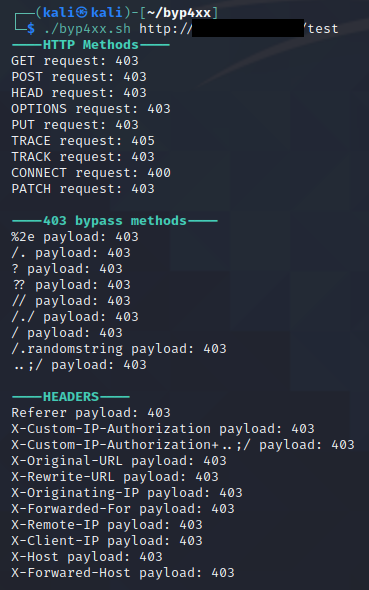

# byp4xx.sh
Simple bash script to bypass "403 Forbidden" messages with well-known methods discussed in #bugbountytips

**Installation:**
git clone https://github.com/lobuhi/byp4xx.git
cd byp4xx
chmod u+x byp4xx.sh

**Usage:**
./byp4xx.sh http(s)://url/path

Use http or https. Start your path with /

**Example:**
./byp4xx.sh https://www.google.es/test

**Features:**
- Multiple HTTP verbs/methods
- Multiple methods mentioned in #bugbountytips
- Multiple headers: Referer, X-Custom-IP-Authorization...

**Tips:**
- You can add proxychains to use with BurpSuite
- Interlace it's a good option for multithread multiple paths

